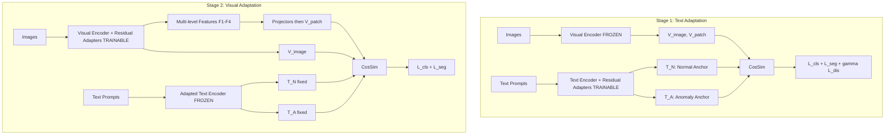

# AA-CLIP: Deep Analysis

---

## 1. Executive Summary

**Vấn đề:** CLIP gốc không phân biệt được "normal" vs "anomaly" trong text/visual space → zero-shot anomaly detection kém.

**One-sentence:** AA-CLIP inject anomaly awareness vào CLIP qua two-stage adaptation (text trước, visual sau) với residual adapters, đạt SOTA zero-shot AD.

**Contribution thật sự:**
1. Phát hiện và formalize "Anomaly Unawareness" trong CLIP - text embeddings của "normal" và "anomaly" gần như trùng nhau
2. Two-stage strategy: fix text anchors trước → align visual features sau
3. Residual Adapter giữ knowledge CLIP gốc, chỉ inject thêm anomaly info
4. SOTA trên 11 datasets (industrial + medical), chỉ cần 2-shot đã competitive

**Đáng đọc vì:** Paper giải quyết root cause (text space) thay vì chỉ patch visual space như các method trước. Approach đơn giản, hiệu quả, parameter-efficient.

---

## 2. Core Problem: Anomaly Unawareness

### "Anomaly Unawareness" là gì?

CLIP được train trên image-text pairs ở **category level** (ví dụ: "a photo of a cat"). Nó KHÔNG bao giờ thấy data kiểu "a photo of a **broken** carpet" vs "a photo of a **normal** carpet". Kết quả:

- Text embeddings cho "broken carpet" và "normal carpet" **gần như identical** trong feature space
- Cosine similarity giữa normal/anomaly text features rất cao (overlap)

### Bằng chứng từ Figure 1 & 2

**Figure 2 (Top):** Cho ảnh carpet bị broken rõ ràng, CLIP vẫn cho similarity cao hơn với "normal" prompt (0.19) so với "broken" prompt (0.18). Probability (τ=0.01) lệch mạnh về normal (0.78 vs 0.22). → CLIP **không nhận ra anomaly**.

**Figure 2 (Bottom):** Heatmap similarity giữa normal/anomaly text features → trong Original CLIP, chúng gần như giống nhau (đỏ cả). Sau text adaptation → tách rõ ràng.

**Figure 3:** t-SNE cho thấy text features của original CLIP: normal (xanh) và anomaly (đỏ) **trộn lẫn**. Sau AA-CLIP → tách biệt rõ, kể cả unseen classes.

### Tại sao vấn đề này critical?

CLIP-based AD methods dùng text embeddings làm "anchor" để so sánh visual features. Nếu anchor normal ≈ anchor anomaly → **mọi visual features đều matching cả hai** → không detect được gì.

---

## 3. Key Insight

### Insight #1: Fix text space TRƯỚC

> Nếu text anchor sai → visual alignment sai. Không thể align visual features tới targets mà bản thân targets đã không phân biệt được normal/anomaly.

Analogy: Bạn muốn phân loại táo tốt vs táo hỏng bằng cách so với mẫu chuẩn. Nếu mẫu chuẩn "táo tốt" và "táo hỏng" giống nhau → so kiểu gì cũng vô nghĩa.

### Insight #2: Residual = controlled adaptation

Full fine-tuning CLIP → catastrophic forgetting (mất class knowledge). Chỉ thêm lightweight residual branch + blending ratio λ → giữ CLIP knowledge + thêm anomaly awareness.

### Insight #3: Disentangle ≠ chỉ classification

Không chỉ cần normal/anomaly text khác nhau, mà cần chúng **orthogonal** (vuông góc) → Disentangle Loss enforce |⟨T_N, T_A⟩|² → 0.

### Nếu text anchor sai thì visual alignment sai thế nào?

- Stage 2 align patch features tới text anchors (frozen từ Stage 1)
- Nếu T_N ≈ T_A → CosSim(V_patch, T_N) ≈ CosSim(V_patch, T_A) cho MỌI patch
- → Anomaly map toàn noise, không localize được gì
- → Classification cũng random vì image-level scores gần bằng nhau

---

## 4. Method Breakdown

### AA-CLIP tổng quan

AA-CLIP = CLIP gốc (frozen) + Residual Adapters (trainable) + Two-stage training. Goal: CLIP mà biết phân biệt normal/anomaly, generalizable tới unseen classes.

### Stage 1: Disentangling Anomaly-Aware Text Anchors

**Mục tiêu:** Làm cho text encoder phân biệt rõ "normal" vs "anomaly" semantics.

| Aspect | Detail |
|--------|--------|
| **Input** | Text prompts: normal ("a photo of [CLS]") + anomaly ("a photo of broken [CLS]") + Images |
| **Output** | Adapted text anchors T_N, T_A ∈ R^d, disentangled |
| **Trainable** | Residual Adapters trong K_T=3 shallow layers của text encoder + final projector |
| **Frozen** | Toàn bộ visual encoder + deep layers text encoder |
| **Loss** | L_align (BCE + Dice + Focal) + γ·L_dis |
| **Intuition** | Dạy text encoder hiểu "broken" thật sự KHÁC "normal", không chỉ là 1 word khác |
| **Training** | 5 epochs, lr=1e-5 |

**Chi tiết:**
- Normal prompts + anomaly prompts → qua adapted text encoder → lấy mean embeddings → T_N, T_A
- So sánh T_N, T_A với visual features (frozen) bằng cosine similarity
- Classification loss (BCE) cho image-level, Segmentation loss (Dice+Focal) cho pixel-level
- Disentangle Loss enforce T_N ⊥ T_A

**Normal Descriptors:** "[CLS]", "a [CLS]", "the [CLS]"
**Anomaly Descriptors:** "damaged [CLS]", "broken [CLS]", "[CLS] with flaw", "[CLS] with defect", "[CLS] with damage"

### Stage 2: Aligning Patch Features According to Text Anchors

**Mục tiêu:** Align visual patch features với text anchors đã disentangled.

| Aspect | Detail |
|--------|--------|
| **Input** | Images + Fixed text anchors từ Stage 1 |
| **Output** | Adapted patch features V_patch, aligned với T_N/T_A |
| **Trainable** | Residual Adapters trong K_I=6 shallow layers visual encoder + 4 Projectors |
| **Frozen** | Text encoder (đã adapted) + deep layers visual encoder |
| **Loss** | L_align = L_cls + L_seg |
| **Intuition** | Dạy visual encoder focus vào anomaly regions, guided bởi text anchors đúng |
| **Training** | 20 epochs, lr=5e-4 |

**Chi tiết:**
- Multi-level features F^i từ layer 6, 12, 18, 24 → qua Projector → V_patch^i
- Aggregate: V_patch = Σ V_patch^i
- CosSim(V_patch, [T_N, T_A]) → segmentation prediction
- CosSim(V_image, [T_N, T_A]) → classification prediction

### Residual Adapter

```
x_residual = Norm(Act(W·x))           # Eq. 1
x_enhanced = λ·x_residual + (1-λ)·x   # Eq. 2, λ=0.1
```

- W ∈ R^(d×d): 1 linear layer, trainable
- Act: activation function, Norm: normalization
- λ=0.1 → 90% original CLIP + 10% adapted → rất conservative
- Chỉ ở shallow layers → deep layers giữ nguyên CLIP knowledge

### Losses

```
L_dis = |⟨T_N, T_A⟩|²                           # Eq. 5 - Disentangle
L_cls = BCE(p_cls, y)                             # Classification
L_seg = Dice(p_seg, S) + Focal(p_seg, S)          # Segmentation
L_align = L_cls + L_seg                           # Eq. 4
L_total = L_align + γ·L_dis                       # Eq. 6 (Stage 1)
L_total = L_align                                 # Stage 2
```

### Inference Flow

1. Input image → adapted visual encoder → V_image + V_patch (multi-level aggregated)
2. Class name → adapted text encoder → T_N, T_A
3. CosSim(V_image, [T_N, T_A]) → anomaly score (image-level)
4. CosSim(V_patch, [T_N, T_A]) → anomaly map (pixel-level)
5. Anomaly = similarity với T_A > similarity với T_N

---

## 5. Architecture Flow

### ASCII Pipeline

```
TRAINING STAGE 1 (Text Adaptation):
━━━━━━━━━━━━━━━━━━━━━━━━━━━━━━━━━
Text Prompts ──→ [Text Encoder + Adapters(trainable)] ──→ T_N, T_A
                                                              │
Images ────────→ [Visual Encoder (FROZEN)] ──→ V_image, V_patch
                                                    │
                              CosSim(V, [T_N, T_A]) │
                                                    ▼
                              L_cls + L_seg + γ·L_dis
                              Backprop → Update text adapters only


TRAINING STAGE 2 (Visual Adaptation):
━━━━━━━━━━━━━━━━━━━━━━━━━━━━━━━━━━━━
Text Prompts ──→ [Adapted Text Encoder (FROZEN)] ──→ T_N, T_A
                                                         │
Images ──→ [Visual Encoder + Adapters(trainable)]        │
              │                                          │
              ├─→ F^1 (layer 6)  → Proj_1 → V_patch^1   │
              ├─→ F^2 (layer 12) → Proj_2 → V_patch^2   │
              ├─→ F^3 (layer 18) → Proj_3 → V_patch^3   │
              └─→ F^4 (layer 24) → Proj_4 → V_patch^4   │
                        │                                │
                   V_patch = Σ V_patch^i                 │
                        │                                │
                   CosSim(V_patch, [T_N, T_A])───────────┘
                        │
                   L_cls + L_seg
                   Backprop → Update visual adapters + projectors


INFERENCE:
━━━━━━━━━━
Image ──→ Adapted Visual Encoder ──→ V_image, V_patch
                                          │
Class Name ──→ Adapted Text Encoder ──→ T_N, T_A
                                          │
                    CosSim ───────────────┘
                       │
              ┌────────┴────────┐
         Anomaly Score     Anomaly Map
         (image-level)     (pixel-level)
```

### Mermaid Diagram



---
## 6. Equations Explained

### Eq. 1 — Residual Adapter

```
x_residual^i = Norm(Act(W^i · x^i))
```

**Đang làm gì:** Biến đổi feature x^i từ transformer layer i qua 1 linear layer (W^i), activation, rồi normalize.

**Tại sao cần:** Tạo "adapted version" của feature, chứa anomaly-specific information mà CLIP gốc không có.

**Nếu bỏ:** Không có cơ chế nào để inject anomaly knowledge vào CLIP → CLIP giữ nguyên anomaly-unaware.

**Note:** W^i ∈ R^(d×d) — đây là adapter rất đơn giản (chỉ 1 linear layer), không phải bottleneck adapter kiểu LoRA. Số params = d² per layer.

---

### Eq. 2 — Residual Fusion

```
x_enhanced^i = λ · x_residual^i + (1-λ) · x^i
```

**Đang làm gì:** Blend feature adapted (x_residual) với feature gốc (x^i) theo tỉ lệ λ.

**Tại sao cần:** λ=0.1 → chỉ 10% adapted, 90% original. Đây là cơ chế **bảo vệ** CLIP knowledge. Nếu adapted feature bị lỗi, ảnh hưởng chỉ 10%.

**Nếu bỏ (dùng x_residual trực tiếp):** → Catastrophic forgetting. Ablation (Table 3 line 2) cho thấy vanilla adapter (không residual) → pixel AUROC giảm từ 88.9 xuống **48.9** (-40.0!), tệ hơn cả CLIP gốc.

**Đây là engineering insight quan trọng nhất** — không phải contribution mới (residual connections có từ ResNet), nhưng là design choice critical.

---

### Eq. 3 — Cosine Similarity Prediction

```
p_cls = CosSim(V_image, [T_N, T_A])
p_seg = CosSim(V_patch, [T_N, T_A])
```

**Đang làm gì:** Tính cosine similarity giữa visual features và text anchors. [T_N, T_A] là concatenation → output là vector 2D (score normal, score anomaly).

**Tại sao cần:** Đây là cơ chế prediction tiêu chuẩn của CLIP-based methods. Không phải contribution mới.

**p_cls ∈ R²:** Image-level — ảnh này normal hay anomaly?
**p_seg ∈ R^(N×2):** Patch-level — mỗi patch normal hay anomaly? → resize lên H×W → anomaly map.

**Nếu bỏ:** Không có prediction nào cả. Đây là backbone, không thể bỏ.

---

### Eq. 4 — Classification + Segmentation Loss

```
L_cls = BCE(p_cls, y)
L_seg = Dice(p_seg, S) + Focal(p_seg, S)
L_align = L_cls + L_seg
```

**Đang làm gì:**
- **BCE:** Binary cross-entropy cho image-level classification (normal/anomaly)
- **Dice:** Overlap-based loss cho segmentation, xử lý class imbalance tốt
- **Focal:** Tập trung vào hard examples, giảm weight easy negatives

**Tại sao cần cả Dice + Focal:** Anomaly regions thường rất nhỏ (< 5% ảnh) → class imbalance nghiêm trọng. Dice loss không bị ảnh hưởng bởi imbalance. Focal loss down-weight easy background pixels.

**Nếu bỏ L_cls:** Mất image-level supervision, chỉ có pixel-level → model có thể detect đúng region nhưng miss overall classification.

**Nếu bỏ L_seg:** Mất pixel-level supervision → model chỉ classify đúng/sai ở image level, không localize được anomaly.

---

### Eq. 5 — Disentangle Loss

```
L_dis = |⟨T_N, T_A⟩|²
```

**Đang làm gì:** Tính inner product (dot product) giữa normal anchor T_N và anomaly anchor T_A, bình phương nó, rồi minimize.

**Intuition:** Inner product = 0 ↔ two vectors are orthogonal (vuông góc). Minimize |⟨T_N, T_A⟩|² → force T_N ⊥ T_A → maximize sự khác biệt semantic.

**Tại sao cần:** L_align (BCE + Dice + Focal) chỉ force model predict đúng, nhưng không guarantee T_N và T_A tách biệt. Có thể model learn shortcut: cả hai anchor gần nhau nhưng visual features vẫn match đúng. L_dis explicitly force anchors tách ra.

**Nếu bỏ:** Ablation (Table 3): pixel AUROC giảm 0.6%, image AUROC giảm 0.7%. Không catastrophic, nhưng consistent improvement. Quan trọng nhất ở image-level.

**Bình phương thay vì absolute:** |·|² smoother gradient near 0, dễ optimize hơn |·|.

---

### Eq. 6 — Total Loss

```
L_total = L_align + γ · L_dis     (γ = 0.1)
```

**Đang làm gì:** Combine alignment loss và disentangle loss. γ=0.1 → disentangle loss chỉ chiếm ~10% weight.

**Tại sao γ nhỏ:** L_dis là regularization, không phải main objective. Nếu γ quá lớn → model focus vào orthogonality hơn accuracy → có thể T_N, T_A orthogonal nhưng không align tốt với visual features.

**Chỉ dùng ở Stage 1.** Stage 2 không cần L_dis vì text anchors đã frozen.

---

### Eq. 7 — Multi-level Patch Aggregation

```
V_patch^i = Proj_i(F^i),  i ∈ {1,2,3,4}
V_patch = Σ V_patch^i
```

**Đang làm gì:** Extract features từ 4 levels (layer 6, 12, 18, 24) của visual encoder, project mỗi level qua learnable projector, rồi sum lại.

**Tại sao cần multi-level:**
- Shallow layers (layer 6): low-level features (edges, textures) → detect small/local anomalies
- Deep layers (layer 24): high-level semantic features → detect large/semantic anomalies
- Sum aggregation → combine cả hai perspectives

**Nếu bỏ (chỉ dùng 1 level):** Miss anomalies ở scales khác. Ví dụ: scratch nhỏ trên metal cần low-level, nhưng missing component cần high-level.

**Proj_i(·):** Linear projection để align channel dimension giữa intermediate features và text anchor dimension d. Trainable trong Stage 2.

---

## 7. Experiments & Results

### Dataset

**Training:** VisA (industrial, 12 classes, diverse objects). VisA results → train on MVTec-AD.

**Testing (zero-shot):** 11 datasets total:
- **Industrial (4):** MVTec-AD, VisA, BTAD, MPDD
- **Medical (7):** Brain MRI, Liver CT, Retina OCT, CVC-ClinicDB, CVC-ColonDB, Kvasir-SEG, CVC-300

### Zero-shot Setting

Train trên VisA → test trên MVTec-AD, BTAD, MPDD, etc. → **classes hoàn toàn unseen**. Đây là true zero-shot: model không thấy category nào từ test set khi training.

### Shot Definitions

| Setting | Meaning | Samples per class |
|---------|---------|-------------------|
| 2-shot | 1 normal + 1 anomaly per class | Minimal |
| 16-shot | 8 normal + 8 anomaly per class | Low-resource |
| 64-shot | 32 normal + 32 anomaly per class | Medium |
| Full-shot | All available training data | Full resource |

Luôn giữ tỉ lệ 1:1 normal:anomaly.

### Key Results (Table 1 - Pixel AUROC)

| Method | Venue | Avg Pixel AUROC |
|--------|-------|-----------------|
| CLIP (baseline) | - | 49.9 |
| WinCLIP | CVPR'23 | 74.7 |
| VAND | CVPRw'23 | 89.3 |
| MVFA-AD | CVPR'24 | 88.5 |
| AnomalyCLIP | ICLR'24 | 91.3 |
| AdaCLIP | ECCV'24 | 90.4 |
| **AA-CLIP (2-shot)** | - | **92.0** |
| **AA-CLIP (64-shot)** | - | **92.8** |
| **AA-CLIP (full)** | - | **93.4** |

**Kết quả quan trọng nhất:** AA-CLIP 2-shot (chỉ 2 samples/class) đã **vượt** tất cả methods dùng full data ở pixel level! Đây là result rất strong.

### Key Results (Table 2 - Image AUROC)

| Method | Avg Image AUROC |
|--------|-----------------|
| AnomalyCLIP (full) | 78.4 |
| AdaCLIP (full) | 80.6 |
| **AA-CLIP (64-shot)** | **83.1** |
| **AA-CLIP (full)** | 82.5 |

**Observation đáng chú ý:** Image-level full-shot (82.5) < 64-shot (83.1). Paper thừa nhận "signs of overfitting with full-shot training". Đây là honest observation.

### Kết quả có thể bị overclaimed?

1. **MPDD image-level:** AA-CLIP (full) = 75.1, trong khi AdaCLIP = 72.1, AnomalyCLIP = 73.7. Improvements nhỏ.
2. **Medical image-level:** Brain MRI full-shot (80.2) thấp hơn AnomalyCLIP (83.3). Liver CT cả nhóm đều ~64-70. → Medical image-level chưa convincing.
3. **Full-shot < 64-shot ở image-level** → model có overfitting, đây là red flag cho scalability.

---

## 8. Ablation Study

### Table 3 Analysis (VisA-trained, 64-shot, tested on unseen datasets)

| # | Method | Pixel AUROC | Image AUROC |
|---|--------|-------------|-------------|
| 0 | CLIP baseline | 50.3 | 69.3 |
| 1 | + Linear Projector (VAND) | 88.9 | 69.3 |
| 2 | + Vanilla Adapter | 48.9 (-40.0) | 53.4 (-15.9) |
| 3 | + Residual Adapter | 91.3 (+2.4) | 80.7 (+11.4) |
| 4 | + Text Residual Adapter | 92.1 (+3.2) | 82.6 (+13.3) |
| 5 | + Disentangle Loss | 92.7 (+3.8) | 83.3 (+14.0) |

### Linear Projector fail ở đâu?

Line 1 (VAND baseline): Pixel AUROC tốt (88.9) nhưng Image AUROC **không đổi** (69.3 = CLIP gốc). Linear projector chỉ align patch features → tốt cho segmentation. Nhưng image-level vẫn dùng CLIP gốc text features → không improve classification.

### Vanilla Adapter fail thảm hại

Line 2: Thêm standard linear adapter (không residual) → **catastrophic collapse**. Pixel 48.9 (tệ hơn CLIP gốc 50.3!), Image 53.4 (-15.9).

**Tại sao:** Adapter thay đổi toàn bộ feature representation → destroy CLIP pretrained knowledge → model mất khả năng nhận diện objects → zero-shot fail.

### Residual Adapter giúp gì?

Line 3: λ·adapted + (1-λ)·original → giữ 90% CLIP + 10% anomaly info. Kết quả: Pixel +2.4, Image **+11.4**. Image-level jump lớn vì residual giữ class knowledge.

### Text Adapter giúp gì?

Line 4: Thêm adapter vào text encoder (Stage 1). Pixel +0.8, Image +1.9 so với line 3. Text adaptation tạo anchor rõ ràng hơn → visual alignment tốt hơn → cải thiện cả hai levels.

### Disentangle Loss giúp gì?

Line 5: Thêm L_dis. Pixel +0.6, Image +0.7. Improvement nhỏ nhưng consistent. **Chủ yếu giúp image-level** — vì orthogonal anchors → classification decision boundary rõ hơn.

### Tại sao one-stage training bị collapse?

**Figure 7:** Khi train cả text + visual encoder cùng lúc (one-stage):
- Epoch 1: text features bắt đầu tách
- Epoch 5: **class information collapse** — tất cả classes merge lại, model quên class knowledge
- Kết quả: Pixel AUROC giảm 1.8, Image AUROC giảm 1.9

**Root cause:** Text encoder và visual encoder compete for optimization. Text encoder muốn maximize anomaly separation, visual encoder muốn align patches. Khi train đồng thời → text encoder over-adapt, destroy class structure.

**AdaCLIP cũng bị vấn đề này** — Figure 7 cho thấy AdaCLIP text features cũng bị collapse tương tự.

### Tại sao two-stage quan trọng?

- Stage 1: Fix visual, chỉ adapt text → text anchors stable, có class structure
- Stage 2: Fix text (đã adapted), chỉ adapt visual → visual features align tới stable anchors
- → Mỗi stage có 1 "anchor point" cố định → tránh both encoders drift simultaneously

---

## 9. Critical Review (Góc nhìn CVPR/ICLR Reviewer)

### Strengths

1. **Clear problem identification:** "Anomaly Unawareness" is well-motivated với Figure 2, 3. T-SNE visualization convincing.
2. **Simple but effective:** No complex architecture, chỉ linear adapters + two-stage training. Easy to understand and reproduce.
3. **Strong results:** 2-shot competitive với full-shot methods khác. Resource-efficient.
4. **Comprehensive evaluation:** 11 datasets, 2 domains (industrial + medical), multiple shot settings.
5. **Honest reporting:** Authors thừa nhận overfitting ở full-shot, discussion about hyperparameter sensitivity.
6. **Good ablation:** Table 3 systematically adds components, Figure 7 visualizes failure mode.

### Weaknesses

1. **Adapter design quá đơn giản:** W ∈ R^(d×d) — full-rank linear, not parameter-efficient. LoRA-style bottleneck có thể hiệu quả hơn với ít params hơn. Paper không so sánh.

2. **Hyperparameter sensitivity không đủ ablation:** λ=0.1, K_T=3, K_I=6, γ=0.1 — paper chỉ dùng 1 set. Không có sensitivity analysis cho các hyperparams này. Tác giả thừa nhận "hyper-parameters should be carefully tuned" nhưng không show data.

3. **Training data dependency:** Train trên VisA → test zero-shot. Nhưng nếu train trên dataset khác (e.g., medical-only) → performance thế nào? Cross-domain transfer chưa được explore kỹ.

4. **Anomaly descriptors là hand-crafted:** "broken", "damaged", "with flaw" — đây là heuristic. Không có ablation cho different prompt sets. Với medical domain, "broken" có phù hợp không?

5. **Full-shot overfitting:** Image AUROC full-shot < 64-shot → model saturates/overfits. Không có solution cho vấn đề này.

6. **Medical image-level results yếu:** Brain MRI image AUROC full-shot = 80.2, thấp hơn AnomalyCLIP 83.3. Liver CT ~64-70 cho tất cả methods. Medical domain chưa convincing ở image level.

### Novelty Assessment

| Component | Novelty |
|-----------|---------|
| Anomaly Unawareness identification | **Genuine contribution** — first to explicitly analyze and formalize |
| Two-stage training | **Moderate** — multi-stage training is common, nhưng application to text-then-visual cho AD là mới |
| Residual Adapter | **Low** — residual connections well-known, adapter concept from NLP/VL literature |
| Disentangle Loss | **Low-moderate** — orthogonality constraint quen thuộc, nhưng application hợp lý |
| Multi-level aggregation | **None** — standard practice, acknowledged as following prior work |

### Soundness

**Mostly sound** nhưng có gaps:
- Two-stage better than one-stage: only 1 comparison (vs one-stage), cần thêm ablation (e.g., visual-first-then-text)
- Disentangle Loss improvement nhỏ (0.6-0.7%) — statistical significance?
- No error bars / multiple runs reported

### Missing Experiments

1. **Reverse order:** Visual adaptation trước, text adaptation sau → so sánh
2. **Different adapter architectures:** LoRA, bottleneck adapter, prefix tuning
3. **Different backbones:** ViT-B/16, ViT-B/32 — chỉ test trên ViT-L/14
4. **Statistical significance:** Multiple runs with different seeds
5. **Computational cost comparison** với other methods (training time, inference time, #params)
6. **Failure case analysis** — khi nào AA-CLIP fail?

### Possible Failure Cases

1. **Anomaly types rất khác training set:** Nếu train trên VisA (scratches, dents) → test trên medical (tumors) → anomaly patterns rất khác. Model có thể learn spurious correlations (e.g., shape-based rather than semantic).
2. **Subtle anomalies:** CLIP features inherently low-resolution (patch-level, not pixel-level) → miss micro-defects.
3. **Novel class names:** Nếu class name không có trong CLIP vocabulary → text anchors yếu.
4. **Tác giả thừa nhận:** "if training data predominantly features round-shaped anomalies, the model may prioritize shape over true semantic understanding" → overfitting to anomaly appearance.

### Risk of Overfitting

**Moderate-to-High:**
- Full-shot < 64-shot ở image level → confirmed overfitting
- λ=0.1 helps nhưng model vẫn có thể overfit to training anomaly patterns
- VisA training bias: VisA anomalies có specific characteristics → model learns VisA-specific patterns

### "Anomaly Awareness" — thật hay heuristic?

**Partially true, partially heuristic:**

**True:** T-SNE (Fig 3) clearly shows disentanglement. Text features DO become more separable.

**Heuristic aspects:**
- "Anomaly awareness" = orthogonal text anchors + aligned patches. Nhưng orthogonal ≠ semantically meaningful. T_N có thể orthogonal với T_A nhưng T_A không capture đúng "anomaly" concept.
- Prompts hand-crafted ("broken", "damaged") — model learn to separate THESE specific prompts, chưa chắc learn general anomaly concept.
- Generalization tốt (Fig 3 right) suggests model DOES learn something beyond specific prompts, nhưng cần thêm evidence (e.g., attention maps, feature analysis cho unseen anomaly types).

### Điểm nào chỉ là heuristic?

1. **λ = 0.1:** Tại sao 0.1? Không có principled way to choose. Trial-and-error.
2. **K_T = 3, K_I = 6:** Shallow layers only — intuition hợp lý nhưng không prove tại sao chính xác 3 và 6.
3. **γ = 0.1:** Weight cho L_dis — arbitrary.
4. **Anomaly descriptors:** "broken", "damaged", "with flaw" — domain-specific heuristic.
5. **Multi-level layers {6,12,18,24}:** Uniform spacing — intuitive nhưng heuristic.

---

## Tổng kết

AA-CLIP là paper **solid** với **clear motivation**, **simple method**, và **strong results**. Contribution chính là **identify + solve Anomaly Unawareness** qua two-stage text-first adaptation. Tuy nhiên, novelty chủ yếu ở **problem formulation** hơn là **technical innovation** (residual adapters, orthogonality loss đều well-known). Paper honest về limitations (overfitting, hyperparameter sensitivity). Đáng đọc cho ai làm zero-shot AD hoặc CLIP adaptation.
